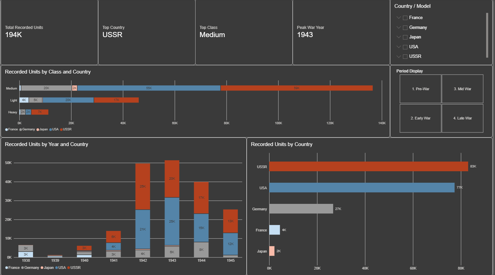

# WWII Tank Production Dashboard

## Overview

This project presents an interactive Power BI dashboard analyzing selected
World War II tank production records by country, model, class, year, and
production period.

## Dashboard Features

- Total recorded production units
- Leading country by recorded production
- Most-produced tank class
- Peak production year
- Production comparison by country and year
- Light, medium, and heavy tank class comparison
- Interactive country, model, and period filters

## Key Findings

- The USSR has the highest recorded production quantity in the selected dataset.
- Medium tanks are the most-produced class.
- 1943 is the peak wartime production year in the selected records.
- Production increased significantly between 1941 and 1943.

## DAX Measures

The dashboard includes DAX measures for:

- Total Recorded Units
- Top Country
- Top Class
- Peak War Year

The Peak War Year measure intentionally returns a blank value when only
Pre-War records are selected.

## Tools Used

- Microsoft Power BI Desktop
- Microsoft Excel
- DAX

## Data Scope and Limitations

This dataset covers selected light, medium, and heavy tank models. It should
not be interpreted as a complete record of all armored fighting vehicle
production.

The 1938 category includes aggregated Pre-War records and is used as a
reporting convention rather than an exact production year for every entry.

French figures primarily represent deliveries rather than strictly
factory-completed production.

Self-propelled guns and tank destroyers were excluded to keep the project
scope consistent.

## Files

- [`ww2_tank_production_dashboard.pbix`](ww2_tank_production_dashboard.pbix) — Power BI report
- [`ww2__tank_production_data.xlsx`](ww2__tank_production_data.xlsx) — Source dataset
- [`dashboard_overview.png`](dashboard_overview.png) — Dashboard preview

## How to View

Download the `.pbix` file and open it using Microsoft Power BI Desktop.

## Data Sources

- [German armored fighting vehicle production during World War II](https://en.wikipedia.org/wiki/German_armored_fighting_vehicle_production_during_World_War_II)
- [French combat vehicle production during World War II](https://en.wikipedia.org/wiki/French_combat_vehicle_production_during_World_War_II)
- [Soviet combat vehicle production during World War II](https://en.wikipedia.org/wiki/Soviet_combat_vehicle_production_during_World_War_II)
- [American armored fighting vehicle production during World War II](https://en.wikipedia.org/wiki/American_armored_fighting_vehicle_production_during_World_War_II)
- [Type 97 Chi-Ha](https://en.wikipedia.org/wiki/Type_97_Chi-Ha_medium_tank)
- [Type 98 Ke-Ni](https://en.wikipedia.org/wiki/Type_98_Ke-Ni_light_tank)
